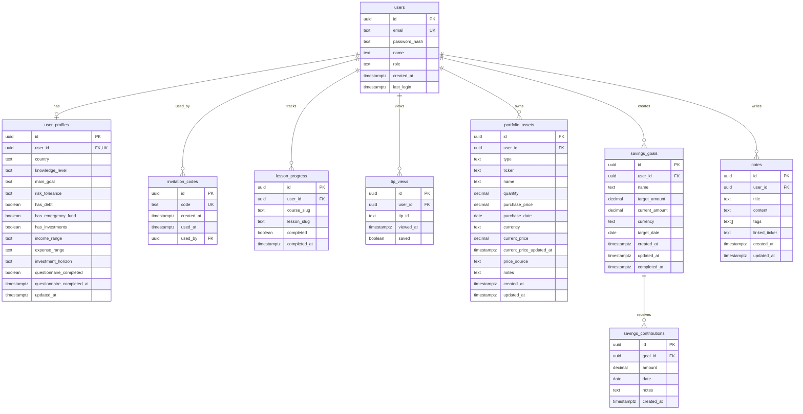

# Finanwas Developer Guide

**Version:** 0.1.0
**Last Updated:** January 20, 2026
**Status:** In Development (MVP Phase)

---

## Table of Contents

- [Overview](#overview)
- [Tech Stack](#tech-stack)
- [Project Structure](#project-structure)
- [Getting Started](#getting-started)
- [Database Schema](#database-schema)
- [Authentication System](#authentication-system)
- [API Development](#api-development)
- [Frontend Development](#frontend-development)
- [Environment Variables](#environment-variables)
- [Testing Strategy](#testing-strategy)
- [Deployment](#deployment)
- [Code Conventions](#code-conventions)
- [Troubleshooting](#troubleshooting)

---

## Overview

Finanwas is a personal finance education and portfolio management web application built with Next.js 16, focusing on:

- **Educational Content (33%)**: Structured courses, daily tips, and glossary
- **Investment Research (33%)**: Company scorecards, comparisons, and market data
- **Portfolio Management (33%)**: Asset tracking, savings goals, and notes

### Design Principles

1. **Mobile-first**: Responsive design prioritizing mobile experience
2. **Progressive complexity**: Start simple, reveal advanced features gradually
3. **User-friendly**: Clear Spanish language, minimal financial jargon
4. **Performance**: Fast load times, optimized API calls
5. **Privacy**: User data stays private, no tracking, invitation-only access

---

## Tech Stack

### Frontend
- **Framework**: Next.js 16.1.4 with App Router
- **React**: 19.2.3
- **TypeScript**: 5.x
- **Styling**: Tailwind CSS v4 + shadcn/ui components
- **Forms**: React Hook Form + Zod validation
- **Charts**: Recharts (planned)
- **Notifications**: Sonner

### Backend
- **Runtime**: Node.js (via Next.js API routes)
- **Database**: PostgreSQL (via Supabase)
- **ORM**: Supabase client for direct SQL queries
- **Authentication**: Custom JWT with bcryptjs hashing
- **File Storage**: Local file system (Markdown content)

### External APIs
- **Yahoo Finance**: Stock market data for US markets
- **DolarApi** (planned): USD/ARS exchange rates

### Development Tools
- **Package Manager**: npm
- **Linter**: ESLint
- **Build Tool**: Turbopack (Next.js default)
- **Version Control**: Git

### Deployment
- **Hosting**: Vercel
- **Database**: Supabase (PostgreSQL)
- **Domain**: TBD

---

## Project Structure

```
finanwas/
├── src/
│   ├── app/                       # Next.js App Router
│   │   ├── api/                   # API routes
│   │   │   └── auth/
│   │   │       ├── validate-code/
│   │   │       │   └── route.ts
│   │   │       └── register/
│   │   │           └── route.ts
│   │   ├── layout.tsx             # Root layout
│   │   ├── page.tsx               # Home page
│   │   └── globals.css            # Global styles + Tailwind config
│   │
│   ├── components/
│   │   ├── ui/                    # shadcn/ui components
│   │   │   ├── button.tsx
│   │   │   ├── card.tsx
│   │   │   ├── input.tsx
│   │   │   ├── label.tsx
│   │   │   ├── form.tsx
│   │   │   ├── sonner.tsx
│   │   │   ├── dropdown-menu.tsx
│   │   │   ├── avatar.tsx
│   │   │   ├── badge.tsx
│   │   │   ├── dialog.tsx
│   │   │   ├── select.tsx
│   │   │   ├── tabs.tsx
│   │   │   ├── progress.tsx
│   │   │   └── skeleton.tsx
│   │   ├── layout/                # Layout components (planned)
│   │   ├── forms/                 # Form components (planned)
│   │   └── charts/                # Chart components (planned)
│   │
│   ├── lib/
│   │   ├── db/
│   │   │   ├── supabase.ts        # Supabase client
│   │   │   └── migrations/        # SQL migration files
│   │   │       ├── 001_create_users_table.sql
│   │   │       ├── 002_create_invitation_codes_table.sql
│   │   │       ├── 003_create_user_profiles_table.sql
│   │   │       ├── 004_create_lesson_progress_table.sql
│   │   │       ├── 005_create_tip_views_table.sql
│   │   │       ├── 006_create_portfolio_assets_table.sql
│   │   │       ├── 007_create_savings_goals_table.sql
│   │   │       ├── 008_create_savings_contributions_table.sql
│   │   │       └── 009_create_notes_table.sql
│   │   ├── auth/
│   │   │   ├── jwt.ts             # JWT sign/verify functions
│   │   │   ├── password.ts        # Password hashing functions
│   │   │   └── cookies.ts         # Auth cookie helpers
│   │   ├── api/                   # External API clients (planned)
│   │   └── utils.ts               # Shared utilities
│   │
│   ├── types/
│   │   └── database.ts            # TypeScript database types
│   │
│   └── hooks/                     # Custom React hooks (planned)
│
├── content/                       # Static content (planned)
│   ├── courses/                   # Markdown lessons
│   ├── tips/                      # JSON tip files
│   └── glossary/                  # JSON glossary
│
├── public/                        # Static assets
│
├── .env.local                     # Local environment variables (not in git)
├── .env.example                   # Environment variables template
├── components.json                # shadcn/ui configuration
├── next.config.js                 # Next.js configuration
├── package.json                   # Dependencies
├── tsconfig.json                  # TypeScript configuration
└── README.md                      # Project readme

```

### Key Directories

- **`src/app/`**: Next.js App Router pages and API routes
- **`src/components/ui/`**: Reusable UI components from shadcn/ui
- **`src/lib/`**: Business logic, utilities, and integrations
- **`src/types/`**: TypeScript type definitions
- **`content/`**: Static Markdown/JSON content for courses and tips
- **`src/lib/db/migrations/`**: SQL migration files (run manually in Supabase)

---

## Getting Started

### Prerequisites

- **Node.js**: 20.x or higher
- **npm**: 10.x or higher
- **Supabase account**: Free tier is sufficient
- **Git**: For version control

### Local Setup

1. **Clone the repository:**
   ```bash
   git clone <repository-url>
   cd FINANCESWAS/Finanwas
   ```

2. **Navigate to the Next.js app:**
   ```bash
   cd finanwas
   ```

3. **Install dependencies:**
   ```bash
   npm install
   ```

4. **Set up Supabase:**
   - Create a new project at [supabase.com](https://supabase.com)
   - Go to Project Settings > API
   - Copy the URL and Service Role Key

5. **Configure environment variables:**
   ```bash
   cp .env.example .env.local
   ```

   Edit `.env.local` and add your values:
   ```env
   NEXT_PUBLIC_SUPABASE_URL=https://your-project.supabase.co
   SUPABASE_SERVICE_ROLE_KEY=your-service-role-key
   JWT_SECRET=your-random-32-char-secret
   NEXT_PUBLIC_APP_URL=http://localhost:3000
   ```

6. **Run database migrations:**
   - Open Supabase SQL Editor
   - Copy and execute each file from `src/lib/db/migrations/` in order (001, 002, 003, etc.)
   - Verify tables are created in Supabase Table Editor

7. **Start development server:**
   ```bash
   npm run dev
   ```

   App will be available at `http://localhost:3000`

8. **Generate invitation codes** (via Supabase SQL Editor):
   ```sql
   INSERT INTO invitation_codes (code) VALUES ('TESTCODE1');
   ```

### Development Workflow

```bash
# Start dev server with Turbopack
npm run dev

# Run linter
npm run lint

# Build for production
npm run build

# Start production server (after build)
npm start
```

---

## Database Schema

Finanwas uses PostgreSQL via Supabase with the following tables:

### Entity Relationship Diagram



### Key Tables

#### users
Stores user accounts with authentication credentials.

**Indexes:**
- `idx_users_email` on `email` (unique, for login)
- `idx_users_role` on `role` (for admin queries)

**Constraints:**
- `role` must be 'user' or 'admin'

---

#### invitation_codes
Manages invitation-only registration system.

**Indexes:**
- `idx_invitation_codes_code` on `code` (unique)
- `idx_invitation_codes_used_at` on `used_at`

**Logic:**
- Code is valid if `used_at IS NULL`
- Upon successful registration, `used_at` and `used_by` are set

---

#### user_profiles
Stores user questionnaire responses for personalization.

**Indexes:**
- `idx_user_profiles_user_id` on `user_id` (unique)
- `idx_user_profiles_questionnaire_completed` on `questionnaire_completed`

**Key Fields:**
- `questionnaire_completed`: Set to `true` when all questions answered
- All questionnaire fields are nullable to allow partial completion

---

#### portfolio_assets
Tracks user investment portfolio.

**Indexes:**
- `idx_portfolio_assets_user_id` on `user_id`
- `idx_portfolio_assets_ticker` on `ticker` (partial: WHERE ticker IS NOT NULL)
- `idx_portfolio_assets_type` on `type`

**Key Fields:**
- `quantity`: DECIMAL(20, 8) supports fractional shares and crypto
- `purchase_price`, `current_price`: DECIMAL(20, 2) for currency precision
- `price_source`: 'api' or 'manual'

---

#### savings_goals & savings_contributions
Manages savings goals and their contribution history.

**Relationships:**
- One goal has many contributions (one-to-many)
- `current_amount` in goals is calculated by summing contributions

---

#### notes
Personal notes with tagging and ticker linking.

**Indexes:**
- `idx_notes_user_id` on `user_id`
- `idx_notes_tags` on `tags` (GIN index for array search)
- `idx_notes_linked_ticker` on `linked_ticker` (partial)
- `idx_notes_updated_at` on `updated_at DESC`

---

### Running Migrations

Migrations must be run manually in Supabase SQL Editor:

1. Open Supabase project
2. Go to SQL Editor
3. Copy content from each migration file in order
4. Execute each migration
5. Verify in Table Editor

**Migration Order:**
1. `001_create_users_table.sql`
2. `002_create_invitation_codes_table.sql`
3. `003_create_user_profiles_table.sql`
4. `004_create_lesson_progress_table.sql`
5. `005_create_tip_views_table.sql`
6. `006_create_portfolio_assets_table.sql`
7. `007_create_savings_goals_table.sql`
8. `008_create_savings_contributions_table.sql`
9. `009_create_notes_table.sql`

---

## Authentication System

Finanwas uses a custom JWT-based authentication system with httpOnly cookies.

### Architecture

```
┌─────────────┐
│   Client    │
└──────┬──────┘
       │
       │ POST /api/auth/register
       │ { code, email, password, name }
       │
       ▼
┌─────────────────────────────────────┐
│   API Route: /api/auth/register     │
│                                     │
│  1. Validate invitation code        │
│  2. Hash password with bcrypt       │
│  3. Create user in database         │
│  4. Mark code as used               │
│  5. Generate JWT token              │
│  6. Set httpOnly cookie             │
│  7. Return user data                │
└─────────────────────────────────────┘
       │
       │ Cookie: auth-token=JWT
       ▼
┌─────────────┐
│   Client    │
│ (Logged In) │
└─────────────┘
```

### Key Files

- **`src/lib/auth/jwt.ts`**: JWT creation and verification using `jose` library
- **`src/lib/auth/password.ts`**: Password hashing using `bcryptjs`
- **`src/lib/auth/cookies.ts`**: Cookie management using Next.js cookies API

### JWT Payload

```typescript
{
  userId: string;      // User UUID
  email: string;       // User email
  role: 'user' | 'admin';
  iat: number;         // Issued at (unix timestamp)
  exp: number;         // Expires at (iat + 7 days)
}
```

### Password Security

- Hashing algorithm: bcrypt
- Salt rounds: 10
- Minimum password length: 8 characters

### Cookie Configuration

```typescript
{
  name: 'auth-token',
  httpOnly: true,              // Not accessible via JavaScript
  secure: process.env.NODE_ENV === 'production',  // HTTPS only in prod
  sameSite: 'lax',
  maxAge: 7 * 24 * 60 * 60,    // 7 days
  path: '/'
}
```

### Protected Routes

To protect an API route, verify the JWT from the cookie:

```typescript
import { getAuthCookie } from '@/lib/auth/cookies'
import { verifyToken } from '@/lib/auth/jwt'

export async function GET(request: NextRequest) {
  const token = await getAuthCookie()

  if (!token) {
    return NextResponse.json({ error: 'No autorizado' }, { status: 401 })
  }

  const payload = await verifyToken(token)

  if (!payload) {
    return NextResponse.json({ error: 'Token inválido' }, { status: 401 })
  }

  // payload.userId, payload.email, payload.role available

  // Your protected logic here
}
```

### Admin-Only Routes

```typescript
if (payload.role !== 'admin') {
  return NextResponse.json(
    { error: 'Se requieren permisos de administrador' },
    { status: 403 }
  )
}
```

---

## API Development

### Creating a New API Route

1. **Create route file:**
   ```
   src/app/api/your-endpoint/route.ts
   ```

2. **Define HTTP methods:**
   ```typescript
   import { NextRequest, NextResponse } from 'next/server'

   export async function GET(request: NextRequest) {
     // GET logic
   }

   export async function POST(request: NextRequest) {
     // POST logic
   }
   ```

3. **Access request data:**
   ```typescript
   // Query parameters
   const { searchParams } = new URL(request.url)
   const id = searchParams.get('id')

   // Request body (POST/PUT)
   const body = await request.json()

   // Cookies
   import { getAuthCookie } from '@/lib/auth/cookies'
   const token = await getAuthCookie()
   ```

4. **Database queries:**
   ```typescript
   import { createClient } from '@/lib/db/supabase'

   const supabase = createClient()

   // Select
   const { data, error } = await supabase
     .from('table_name')
     .select('*')
     .eq('column', value)

   // Insert
   const { data, error } = await supabase
     .from('table_name')
     .insert({ column: value })
     .select()
     .single()

   // Update
   const { data, error } = await supabase
     .from('table_name')
     .update({ column: value })
     .eq('id', id)

   // Delete
   const { data, error } = await supabase
     .from('table_name')
     .delete()
     .eq('id', id)
   ```

5. **Return responses:**
   ```typescript
   // Success
   return NextResponse.json({ data }, { status: 200 })

   // Created
   return NextResponse.json({ data }, { status: 201 })

   // Error
   return NextResponse.json({ error: 'Message' }, { status: 400 })
   ```

### API Best Practices

- Always validate input with Zod schemas
- Return Spanish error messages (user-facing)
- Use proper HTTP status codes
- Add try-catch blocks for error handling
- Log errors for debugging
- Type your responses with TypeScript
- Add JSDoc comments for better IDE support

### Example: Complete CRUD Endpoint

```typescript
import { NextRequest, NextResponse } from 'next/server'
import { createClient } from '@/lib/db/supabase'
import { getAuthCookie } from '@/lib/auth/cookies'
import { verifyToken } from '@/lib/auth/jwt'
import type { Note } from '@/types/database'

// GET /api/notes
export async function GET(request: NextRequest) {
  try {
    const token = await getAuthCookie()
    if (!token) {
      return NextResponse.json({ error: 'No autorizado' }, { status: 401 })
    }

    const payload = await verifyToken(token)
    if (!payload) {
      return NextResponse.json({ error: 'Token inválido' }, { status: 401 })
    }

    const supabase = createClient()
    const { data, error } = await supabase
      .from('notes')
      .select('*')
      .eq('user_id', payload.userId)
      .order('updated_at', { ascending: false })

    if (error) {
      throw error
    }

    return NextResponse.json({ notes: data }, { status: 200 })
  } catch (error) {
    console.error('Error fetching notes:', error)
    return NextResponse.json(
      { error: 'Error al obtener notas' },
      { status: 500 }
    )
  }
}

// POST /api/notes
export async function POST(request: NextRequest) {
  try {
    const token = await getAuthCookie()
    if (!token) {
      return NextResponse.json({ error: 'No autorizado' }, { status: 401 })
    }

    const payload = await verifyToken(token)
    if (!payload) {
      return NextResponse.json({ error: 'Token inválido' }, { status: 401 })
    }

    const body = await request.json()
    const { title, content, tags, linked_ticker } = body

    // Validation
    if (!title || !content) {
      return NextResponse.json(
        { error: 'Título y contenido son requeridos' },
        { status: 400 }
      )
    }

    const supabase = createClient()
    const { data, error } = await supabase
      .from('notes')
      .insert({
        user_id: payload.userId,
        title,
        content,
        tags: tags || [],
        linked_ticker: linked_ticker || null
      })
      .select()
      .single()

    if (error) {
      throw error
    }

    return NextResponse.json({ success: true, note: data }, { status: 201 })
  } catch (error) {
    console.error('Error creating note:', error)
    return NextResponse.json(
      { error: 'Error al crear nota' },
      { status: 500 }
    )
  }
}
```

---

## Frontend Development

### Page Structure (App Router)

```typescript
// src/app/dashboard/page.tsx
export default function DashboardPage() {
  return (
    <div>
      <h1>Dashboard</h1>
      {/* Page content */}
    </div>
  )
}
```

### Using shadcn/ui Components

```typescript
import { Button } from '@/components/ui/button'
import { Card, CardHeader, CardTitle, CardContent } from '@/components/ui/card'

export default function Example() {
  return (
    <Card>
      <CardHeader>
        <CardTitle>Example Card</CardTitle>
      </CardHeader>
      <CardContent>
        <Button>Click me</Button>
      </CardContent>
    </Card>
  )
}
```

### Forms with React Hook Form + Zod

```typescript
'use client'

import { useForm } from 'react-hook-form'
import { zodResolver } from '@hookform/resolvers/zod'
import { z } from 'zod'
import { Button } from '@/components/ui/button'
import { Input } from '@/components/ui/input'
import { Label } from '@/components/ui/label'

const schema = z.object({
  name: z.string().min(1, 'Nombre es requerido'),
  email: z.string().email('Email inválido')
})

type FormData = z.infer<typeof schema>

export default function ExampleForm() {
  const { register, handleSubmit, formState: { errors } } = useForm<FormData>({
    resolver: zodResolver(schema)
  })

  const onSubmit = async (data: FormData) => {
    // Submit logic
  }

  return (
    <form onSubmit={handleSubmit(onSubmit)}>
      <div>
        <Label htmlFor="name">Nombre</Label>
        <Input id="name" {...register('name')} />
        {errors.name && <p>{errors.name.message}</p>}
      </div>

      <Button type="submit">Enviar</Button>
    </form>
  )
}
```

### Client vs Server Components

- **Server Components** (default): Fetch data, access DB, use environment variables
- **Client Components** (`'use client'` directive): Interactive, use hooks, access browser APIs

```typescript
// Server Component (default)
export default async function ServerComponent() {
  const data = await fetch('...')
  return <div>{data}</div>
}

// Client Component
'use client'
import { useState } from 'react'

export default function ClientComponent() {
  const [count, setCount] = useState(0)
  return <button onClick={() => setCount(c => c + 1)}>{count}</button>
}
```

### Tailwind CSS Usage

Finanwas uses Tailwind v4 with configuration in `src/app/globals.css`:

```css
@import "tailwindcss";

@theme inline {
  --color-primary: oklch(0.62 0.18 165);
  --color-surface: oklch(0.99 0.99 0);
  /* ... */
}
```

Use color classes:
```tsx
<div className="bg-primary text-white">
  <p className="text-success">Profit: +23%</p>
</div>
```

---

## Environment Variables

### Required Variables

```env
# Supabase
NEXT_PUBLIC_SUPABASE_URL=https://xxx.supabase.co
SUPABASE_SERVICE_ROLE_KEY=eyJxxx...

# JWT
JWT_SECRET=your-random-32-character-secret-key

# App
NEXT_PUBLIC_APP_URL=http://localhost:3000
```

### Variable Naming Convention

- `NEXT_PUBLIC_*`: Exposed to client-side code
- No prefix: Server-side only

### Accessing in Code

```typescript
// Server-side (API routes, Server Components)
const secret = process.env.JWT_SECRET

// Client-side (Client Components)
const appUrl = process.env.NEXT_PUBLIC_APP_URL
```

---

## Testing Strategy

**Status:** Planned (not yet implemented in MVP)

### Planned Testing Approach

1. **Unit Tests**: Jest + React Testing Library
   - Test individual components
   - Test utility functions
   - Test API endpoint logic

2. **Integration Tests**: Playwright or Cypress
   - Test authentication flow
   - Test CRUD operations
   - Test multi-step forms

3. **E2E Tests**: Playwright
   - Test complete user journeys
   - Test registration → onboarding → usage

### Running Tests (Future)

```bash
# Unit tests
npm run test

# E2E tests
npm run test:e2e

# Coverage
npm run test:coverage
```

---

## Deployment

### Vercel Deployment

1. **Connect Repository:**
   - Go to [vercel.com](https://vercel.com)
   - Import Git repository
   - Select `finanwas` directory as root

2. **Configure Environment Variables:**
   - Add all variables from `.env.example`
   - Use production values for Supabase

3. **Deploy:**
   - Vercel auto-deploys on push to main
   - Preview deployments for branches

### Build Configuration

```js
// next.config.js
module.exports = {
  reactStrictMode: true,
  // Add any custom config here
}
```

### Pre-deployment Checklist

- [ ] All migrations run in production Supabase
- [ ] Environment variables set in Vercel
- [ ] JWT_SECRET is strong random string
- [ ] NEXT_PUBLIC_SUPABASE_URL points to production
- [ ] Test build locally: `npm run build`
- [ ] At least one admin user exists
- [ ] Invitation codes generated

---

## Code Conventions

### TypeScript

- Use strict mode
- Avoid `any` type
- Use interfaces for object shapes
- Export types from `@/types/database`

### Naming

- **Files**: kebab-case (`user-profile.tsx`)
- **Components**: PascalCase (`UserProfile`)
- **Functions**: camelCase (`getUserProfile`)
- **Constants**: UPPER_SNAKE_CASE (`MAX_UPLOAD_SIZE`)

### Imports

Use `@/` alias for absolute imports:

```typescript
import { Button } from '@/components/ui/button'
import { createClient } from '@/lib/db/supabase'
import type { User } from '@/types/database'
```

### Comments

- Add JSDoc comments to functions
- Explain "why", not "what"
- Comment complex business logic

```typescript
/**
 * Validates invitation code and creates new user account
 * @param code - Invitation code from user input
 * @param userData - User registration data
 * @returns Created user object
 */
export async function registerUser(code: string, userData: UserData) {
  // Implementation
}
```

### Git Commits

Follow conventional commits:

```
feat: Add user profile questionnaire
fix: Correct JWT expiration time
docs: Update API documentation
refactor: Simplify auth middleware
```

---

## Troubleshooting

### Common Issues

**Issue: "Cannot find module '@/...'**

**Solution:** Check `tsconfig.json` has correct paths configuration:
```json
{
  "compilerOptions": {
    "paths": {
      "@/*": ["./src/*"]
    }
  }
}
```

---

**Issue: Supabase client errors**

**Solution:**
- Verify environment variables are set
- Check Supabase project is running
- Confirm service role key (not anon key) is used

---

**Issue: JWT verification fails**

**Solution:**
- Ensure JWT_SECRET matches between token creation and verification
- Check token hasn't expired (7 days max)
- Verify cookie is being sent with request

---

**Issue: CORS errors**

**Solution:**
- Check `NEXT_PUBLIC_APP_URL` is correct
- Verify API route paths are correct
- Ensure using same domain for frontend and API

---

**Issue: Build fails in Vercel**

**Solution:**
- Run `npm run build` locally to reproduce
- Check all environment variables are set in Vercel
- Verify TypeScript has no errors: `npx tsc --noEmit`

---

**Issue: Tailwind styles not applying**

**Solution:**
- Check `@import "tailwindcss"` is in `globals.css`
- Verify class names are correct
- Try restarting dev server
- Check for typos in custom color names

---

## Additional Resources

- [Next.js Documentation](https://nextjs.org/docs)
- [Supabase Documentation](https://supabase.com/docs)
- [shadcn/ui Documentation](https://ui.shadcn.com)
- [Tailwind CSS v4 Documentation](https://tailwindcss.com/docs)
- [React Hook Form](https://react-hook-form.com)
- [Zod Validation](https://zod.dev)

---

## Changelog

| Date | Version | Changes |
|------|---------|---------|
| 2026-01-20 | 0.1.0 | Initial developer guide created |

---

## Contributing

This is a personal project. If you have suggestions or find bugs, please discuss with the project owner.

### Development Process

1. Create feature branch from `main`
2. Implement feature
3. Test locally
4. Commit with conventional commit message
5. Push and create PR (if applicable)
6. Deploy to Vercel preview
7. Merge to `main` for production deployment
